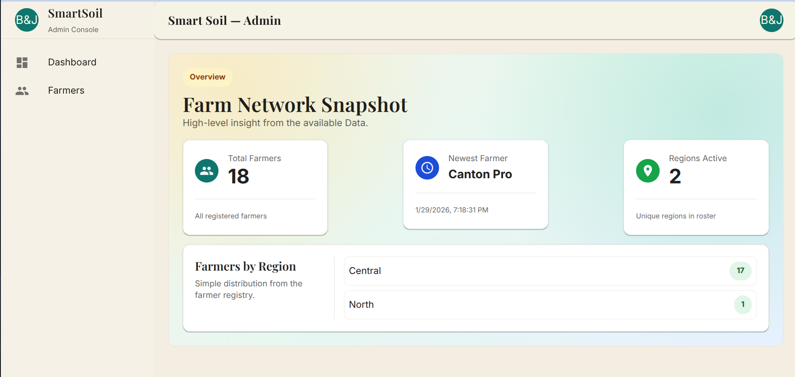
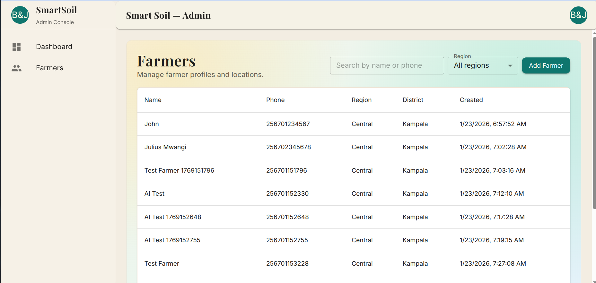
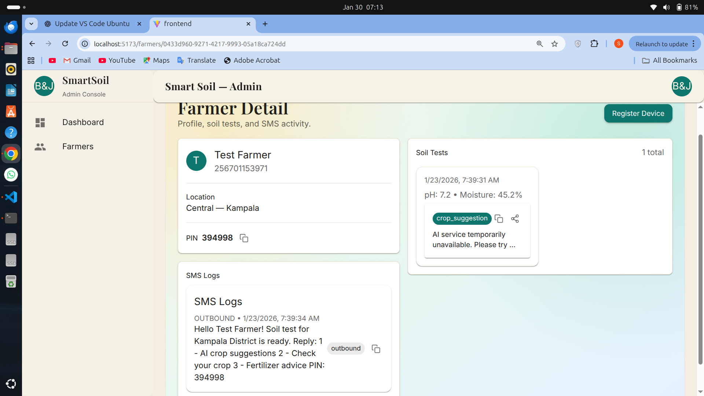
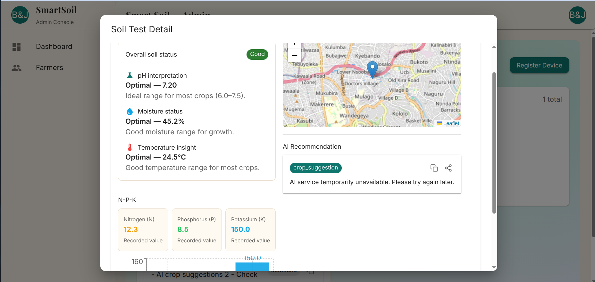

# Smart Soil Platform — Frontend

Admin dashboard for managing farmers and viewing soil test insights. Built with React, TypeScript, Vite, Material UI, and TanStack Query.

## Features
- Farmer listing and detail view
- Device registration (token returned from backend)
- Soil test insights (pH, moisture, temperature, NPK) and map view
- SMS logs and AI recommendation display

## Requirements
- Node.js 18+
- Backend running (see `README.md` at repo root)

## Setup
```bash
cd frontend
npm install
```

## Environment
Create a `.env` file in `frontend/`:
```bash
VITE_BACKEND_URL=http://localhost:8000
```
If omitted, the app defaults to `http://localhost:8000`.

## Run
```bash
npm run dev
```
Open the URL shown in the terminal (default: `http://localhost:5173`).

## Build
```bash
npm run build
npm run preview
```

## Screenshots
Add screenshots to `frontend/public/screenshots/` and reference them below.

Current screenshots:

- Dashboard  
  
- Farmers List  
  
- Farmer Detail  
  
- Soil Test Detail  
  


## Key Paths
- `frontend/src/pages/FarmersList.tsx` — farmer list
- `frontend/src/pages/FarmerDetail.tsx` — farmer profile + soil tests
- `frontend/src/pages/DeviceRegistration.tsx` — device registration dialog
- `frontend/src/pages/SoilTestDetail.tsx` — soil test insights
- `frontend/src/api/mockApi.ts` — backend API calls

## Notes
- Device listing UI was removed because there is no backend endpoint yet.
- Soil test insights are derived from the backend values in each test record.
